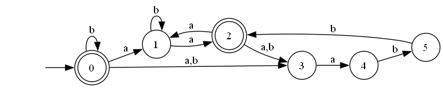
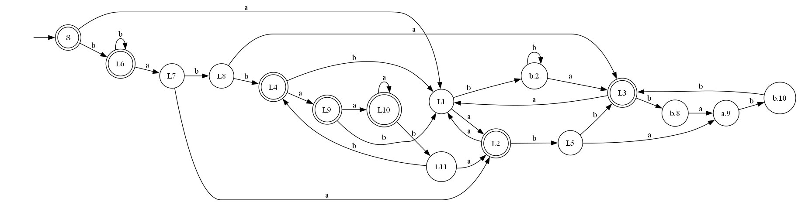
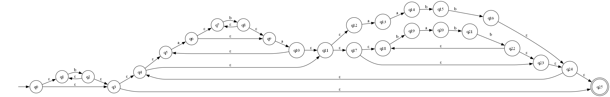

Дана регулярка `b*((ab*a)*(aabb|(babb)*))*`

## НКА Томпсона

## ДКА

Таблица классов эквивалентности ДКА:

| префикс | ε | a | b | aa | ab | ba | bb | aaa | aab | aba | bab | baa | bba | abb | bbb | aaaa | aaab |
|:-------:|:-:|:-:|:-:|:--:|:--:|:--:|:--:|:---:|:---:|:---:|:---:|:---:|:---:|:---:|:---:|:----:|:----:|
|    ε    | + | - | + | +  | -  | -  | +  | -   | -   | +   | -   | +   | -   | -   | +   | +    | -    |
|    a    | - | + | - | -  | -  | +  | -  | +   | -   | -   | -   | -   | +   | +   | -   | -    | -    |
|    b    | + | - | + | +  | -  | -  | +  | -   | -   | +   | -   | +   | -   | +   | +   | +    | -    |
|   aa    | + | - | - | +  | -  | -  | +  | -   | -   | +   | -   | -   | -   | -   | -   | +    | -    |
|   ab    | - | + | - | -  | -  | +  | -  | +   | -   | -   | -   | -   | +   | -   | -   | -    | -    |
|   ba    | - | + | - | -  | -  | +  | +  | +   | -   | -   | -   | -   | +   | +   | -   | -    | -    |
|  aba    | + | - | - | +  | -  | -  | -  | -   | -   | +   | -   | -   | -   | -   | -   | +    | -    |
|  bab    | - | + | + | -  | -  | +  | -  | +   | -   | -   | -   | +   | +   | -   | -   | -    | -    |
|  aab    | - | - | + | -  | -  | -  | -  | -   | -   | -   | -   | +   | -   | +   | -   | -    | -    |
|  babb   | + | + | - | +  | -  | +  | -  | +   | -   | +   | -   | -   | +   | -   | -   | +    | -    |
| aaba    | - | - | - | -  | -  | -  | +  | -   | -   | -   | -   | -   | -   | -   | -   | -    | -    |
| abab    | - | - | - | -  | -  | -  | -  | -   | -   | -   | -   | -   | -   | +   | -   | -    | -    |
| babba   | + | + | - | +  | -  | +  | -  | +   | -   | +   | -   | -   | +   | +   | -   | +    | -    |
| aabaa   | - | - | - | -  | -  | -  | -  | -   | -   | -   | -   | -   | -   | -   | -   | -    | -    |
| aabab   | - | - | + | -  | -  | -  | -  | -   | -   | -   | -   | +   | -   | -   | -   | -    | -    |
| babbaa  | + | + | - | +  | -  | +  | +  | +   | -   | +   | -   | -   | +   | +   | -   | +    | -    |
| babbaab | - | + | + | -  | -  | +  | -  | +   | -   | -   | -   | +   | +   | +   | -   | -    | -    |

## НКА

Таблица множеств классов эквивалентности НКА:

| Префикс | ε   | a   | b   | bb  | abb | bbb |
|---------|-----|-----|-----|-----|-----|-----|
| ε       | +   | -   | +   | +   | -   | +   |
| a       | -   | +   | -   | -   | +   | -   |
| aba     | +   | -   | -   | -   | -   | -   |
| ab      | -   | +   | -   | -   | -   | -   |
| ababa   | -   | -   | -   | +   | -   | -   |
| bab     | -   | +   | +   | -   | -   | -   |

## ПКА

Минимальный переключающийся автомат с конъюнкцией будет совпадать с минимальным НКА, потому что все недетерминированные переходы являются взаимоисключающими.
Нет ситуации, где нужно отслеживать несколько параллельных путей одновременно, конъюнкция не дает преимуществ для нашей регулярки.

## Расширенная регулярка

1) wildcard - операция не имеет смысла для нашей регулярки, потому что нет ситуации a|b, в которой могли бы заменить это на символ .
2) Положительная итерация и опция тоже не имеют смысла хотя бы потому, что у нас нет ситуации tt*
3) Операции предпросмотра, ретроспективной проверки и их отрицательные версии тоже не имеют смысла, потому что ничего не упростят, а только усложнят регулярку
4) Классы букв и их дополнения также не имеют смысла, опять же потому что у нас нет a|b, да ещё и имеем всего две буквы, а значит два класса.
5) Вот и остаются только маркеры начала и конца выражения - очевидно, что они не испортят нам исходную регулярку, поэтому расширенное регулярное выражение будет распознавать тот же язык.
