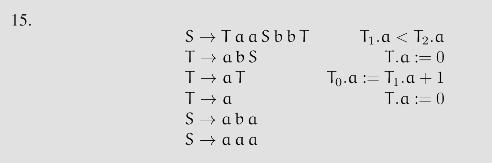
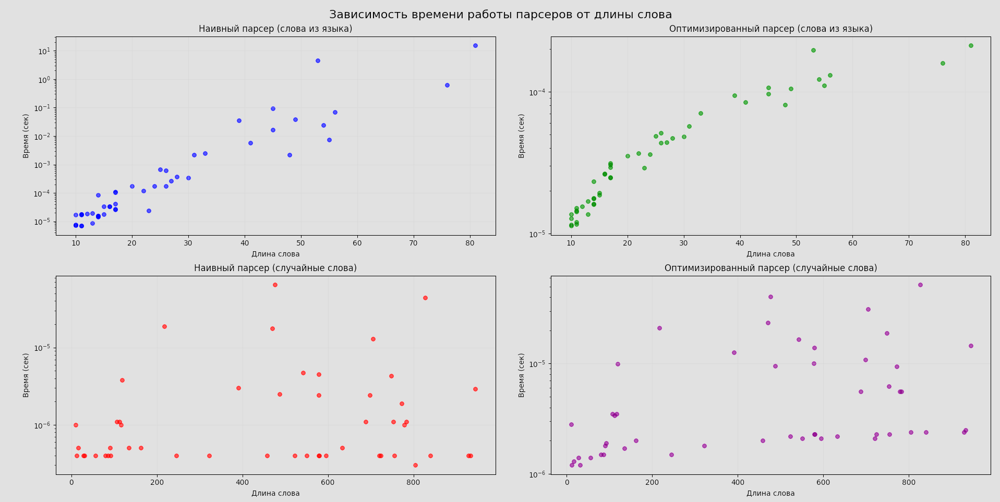

# Анализ на КС и регулярность

Пересечём язык с регуляркой $a^{+}aaababba^{+}$. Получаем язык { $a^{n}aaababba^{n+k} | n, k > 0$ }. Этот язык получен раскрытиями $S \rightarrow TaaSbbT$, $T \rightarrow aT | a$. Возьмём слово $a^{p}aaababba^{p+1}$. Очевидным образом по лемме о накачке выходим из пересечения (качать левый блок вверх, качать центральную часть нельзя, качать правый блок вниз). Так что язык не регулярен.

# Доделать анализ на КС
Рассматриваем это же слово, анализируем на КС.

# Оптимизация парсера
Парсер использует мемоизацию. Для каждой пары (нетерминал, позиция) сохраняем результат, чтобы заново не вычислять. Сложность оптимизированного парсера $O(n^{4})$

