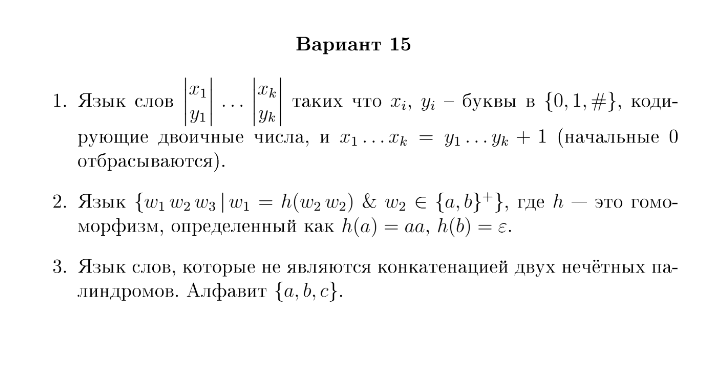
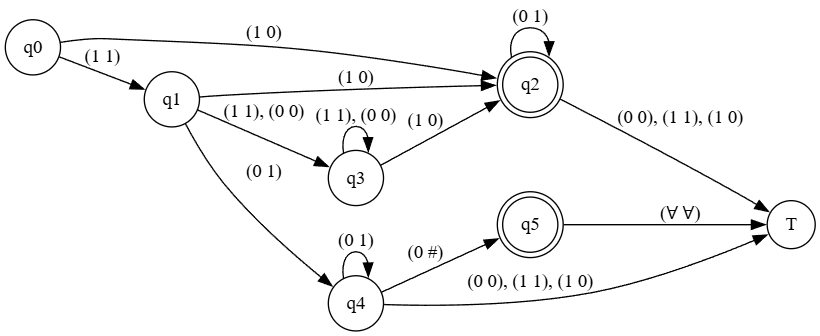

## 1

На семинаре мы решали похожую задачу, но в десятичной системе счисления, поэтому интуитивно понятно, что язык тоже должен быть регулярен, поэтому сразу построим для него автомат.

## 2

Начнём с того, что если слово начинается на $b$, то оно всегда принадлежит языку, потому что $w\_1 = h(w\_2w\_2) = \\varepsilon$, $w\_2w\_3 = b...$ В $w\_3$ лежит что угодно, поэтому можем все лишние буквы закидывать в $w\_3$, в $w\_2$ тогда сколько угодно букв $b$. Это даёт нам регулярку $b^+(a|b)^\*$.

Если слово начинается на $a$, то 100% $w\_1$ не пустое, причём должно быть обязательно хотя бы 4 буквы $a$ в начале (по свойству гомоморфизма получаем, что $w\_1 = h(w\_2w\_2) = a^{4n}$, $|w\_2|\_a = n \\neq 0$). Тогда если в начале слова идёт хотя бы 4 буквы $a$ подряд, то первые 4 буквы $a$ закидываем в $w\_1$, затем закидываем в $w\_2$ все буквы $b$, пока не встретим пятую букву $a$, которую закидываем в $w\_2$, а всю оставшуюся строку закидываем в $w\_3$ и слова такого вида тоже принадлежат языку.

Теперь регулярка имеет вид $((aaaa)^+(b^\*a^+)(a|b)^\*) | (b^+(a|b)^\*)$.

## 3

### Регулярность

Так как регулярные языки замкнуты относительно дополнения, то рассмотрим дополнение к языку из задания (язык слов, являющихся конкатенацией двух нечётных палиндромов)

Рассмотрим строки — префиксы вида $(cab)^i$ для $i = 1, \dots, k+1$ и столбцы — суффиксы вида $(acb)^j aca$ для $j = 0, \dots, k$.

Таблица имеет размер $(k+1) \times (k+1)$. Элемент на пересечении $i$-й строки и $j$-го столбца соответствует слову:

$(cab)^i(acb)^jac$ - первый нечётный палиндром, $a$ - второй палиндром

На главной диагонали это слово является конкатенацией двух нечётных палиндромов а вне главной диагонали — нет

| Префикс \ Суффикс | $aca$ | $acbaca$| $acbacbaca$ | ... | $(acb)^k aca$ |
|-------------------|---------------|------------------|---------------------|-----|----------------------|
| $cab$     | **+**         | –                | –                   | ... | –                    |
| $(cab)^2$ | –             | **+**            | –                   | ... | –                    |
| $(cab)^3$ | –             | –                | **+**               | ... | –                    |
| ...               | ...           | ...              | ...                 | ... | ...                  |
| $(cab)^{k+1}$ | –       | –                | –                   | ... | **+**                |

Получаем бесконечное число классов эквивалентности - дополнение нерегулярно - язык нерегулярен

### КС

Рассматриваем слова вида $a^{k_1} b a^{k_2} b a^{k_3}$. Слова такого вида выходят из языка (являются конкатенацией двух нечётных палиндромов), когда выполнено хотя бы одно условие:

1) $k_1 + k_3 \equiv 1 \pmod{2}$ и $k_2 \equiv 1 \pmod{2}$  
2) $k_1 + k_3 = k_2$, $k_2 = \equiv 0 \pmod{2}$ (могут быть и нулевыми, тогда слово $bb$ тоже в дополнении)

Зная это, применим лемму о накачке к слову $a^{3m}ba^{4m}ba^{3m}$, $2m < N < 3m$ ($N$ - длина накачки), $m$ - нечётное

$w = xyzuv$, $|yu| > 0$ (хотя бы одна из частей y или u ненупустая), $|yzu| < N$ (длины накачки) 

Обозначим $a^{3m} = t_1$, $a^{4m}$ = $t_2$, $a^{3m}$ = $t_3$

Условие 1 кратко звучит так: $t_1$ $t_2$ $t_3$ должны быть чнн или ннч (н-нечет, ч-чёт)

Сразу скажем, что накачка $t_1$ и $t_3$ одновременно невозможна (между ними блок $bt_2b$ длиной $4m+2$ > $N$)

Выбирая разбиение так, что накачиваем только $t_1$, при накачке мы можем занулить $2m$ штук букв $a$ получим $a^{m}ba^{4m}ba^{3m}$ - условие 2

Симметрично попадаем в условие 2 с конца строки если выбираем разбиение с накачкой только $t_3$

Накачивая только $t_2$, при накачке мы можем добавить $2m$ штук букв $a$ ($i = 2m$) $a^{3m}ba^{6m}ba^{3m}$ - условие 2

Осталось понять, что будет, если мы накачаем одновременно $t_1$ и $t_2$ (случай накачки $t_3$ и $t_2$ симметричный)

Получим при нечётном $i$: $a^{3m+i}ba^{4m+i}ba^{3m}$ - это условие 1 (получили чнн, при накачке $t_3$ будет ннч)

Теперь что будет, если накачивать будем какую-то из букв $b$: мы возьмём нулевую накачку, получим, например $a^{4m}ba^{m}$ = $a^{3m}a^{m}ba^{m}$ - два нечётных палиндрома, выходит из языка в случае любой из букв b, обе буквы b сразу накачать нельзя (аналогично $t_1$ и $t_3$ у нас там $4m$ букв)

Таким образом, при любом разбиении мы всегда выходим из языка, поэтому по лемме о накачке наш язык не является контекстно-свободным
