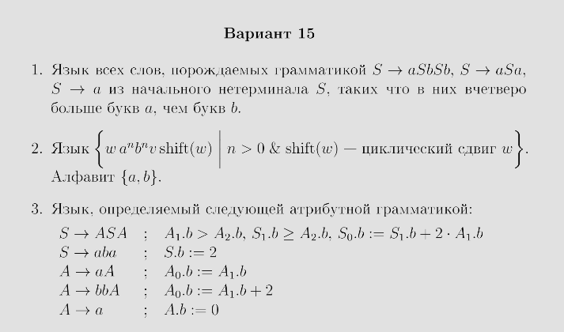
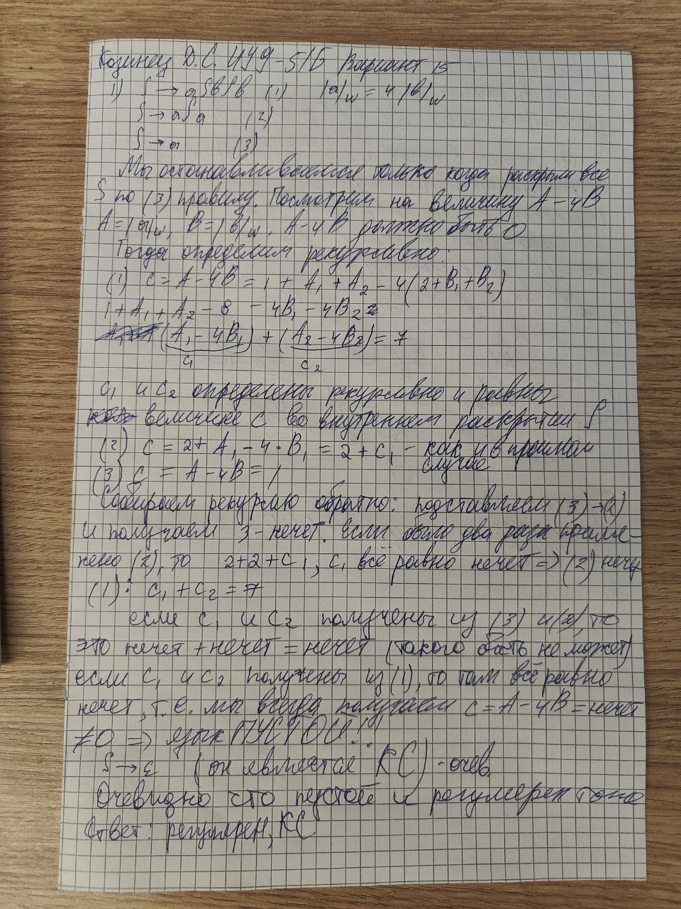

## 1

Насколько я понимаю, первую задачу я решил правильно, поэтому я просто прикреплю фото с листочка, который сдавал

## 2

## Доделать
Пересечём язык с регуляркой $b^{+}a^{+}b^{+}a^{*}$, получим слова вида { $b^{k}a^{n}b^{l}a^{m}$ }, где $n - m = l - k$. 

## 3

Так как мы обязательно завершаемся в случае, когда $S$ раскрыли в $aba$, и $aba$ мы можем получить только в этом случае (в любом другом случае $bb$ идут парами), то $aba$ является разделителем слова. Тогда язык состоит из слов, где слева и справа от $aba$ перемешаны буквы $a$ и $bb$. Причём, рекурсивно раскрывая $S$, мы видим, что на каждом этапе слева от $S$ пар $bb$ больше, чем справа от $S$. Значит, когда мы дойдём до $aba$, то слева от $aba$ будет больше пар $bb$, чем справа от $aba$. Пересекаем язык с регуляркой $b^{\*}aabab^{\*}a$. Получаем язык вида { $b^{2n}aabab^{2m}a | n > m$ }. Теперь рассмотрим слово $b^{2n}aabab^{2n-2}a$. Оно лежит в пересечении. Применим лемму о накачке. $p = n$ - длина накачки. Разбиваем слово $w = xuyvz$, $| uyv | < p$, $| uv | >= 1$. Если накачка задевает центральный блок $aaba$ между блоками букв $b$, то мы выйдем из языка, потому что эта центральная часть фиксирована. Мы не можем накачать букву $a$ в конце слове по той же причине (для этого мы и пересекали с регуляркой, чтобы запретить качать эти буквы и рассматривать только блоки букв $b$). Если накачивать блок справа от $aaba$, то выйдем из языка, потому что справа букв $b$ мы сделаем больше, чем слева. Если накачивать блок слева от $aba$, то мы захватываем хотя бы одну или две буквы $b$. Если одну - то меняем четность - вышли из языка. Если две и больше - зануляем их - и тогда мы получили слева <= $2n-2$ букв $b$, тоже вышли из языка. Таким образом, пересечение исходного языка с регулярным не КС, значит и исходный язык не КС.
